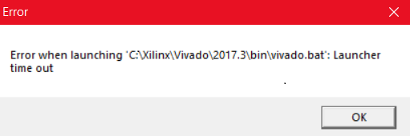

## 使用技巧

### edif文件的使用
edif是Vivado下的网表文件，可在设计中创建低层次网表文件，以实现自底向上的综合设计流程

edif文件的生成流程：
1. 创建一个工程，将要生成的模块设置为top module
2. 在综合设置窗口的Options下面最后一项 More Options一栏写入“-no_iobuf”
3. 综合后Open Synthesized Design
4. 在TCL console中输入`write_edif /path/xx.edif`生成edif文件

edif文件的使用：
1. 接上生成流程，在TCL console中输入`write_verilog -mode synth_stub /path/xx_stub.sv`生成stub文件
2. 在上层工程中导入xx.edif和xx_stub.sv文件，其中stub文件是网表文件的端口描述，可用于新工程中该网表的实例化
3. 在上层工程中按照stub文件中的端口描述实例化网表模块即可

## 问题信息

### Vivado 2017.3 启动超时
Vivado启动两分钟后弹出如下界面，显示Vivado启动超时：

我是在更新了Windows10系统到1790版本后出现这一问题，在[Xilinx论坛](https://forums.xilinx.com)发现同一问题，Xilinx官方也发现并解决了这个BUG。

> After installing the Windows 10 Fall Creators update (version 1709), when I try to launch Vivado, it fails or crashes.

解决方法如下[AR# 69908](https://www.xilinx.com/support/answers/69908.html)：

> While this update for Windows 10 is not officially supported with Vivado 2017.3, the following work-around is available:
> 1.  Navigate to (Vivado Installed Directory)\2017.3\bin\unwrapped\win64.o
> 2.  Backup '**vivado.exe**' by renaming it to '**vivado.exe.backup**'
> 3.  Copy '**vivado-vg.exe**' and paste it into the same folder.
> 4.  Rename '**vivado-vg - Copy.exe**' to '**vivado.exe**'

简单翻译一下：
当Windows10更新之后发现不能打开Vivado时，执行以下步骤：
- 进入“Vivado安装目录\2017.3\bin\unwrapped\win64.0\”
- 将'**vivado.exe**'重命名为**vivado.exe.backup**'
- 将'**vivado-vg.exe**' 复制到当前目录
- 重命名'**vivado-vg - Copy.exe**'为'**vivado.exe**'
之后再打开Vivado就不会报错了

### 文件路径过长
使用Vivado时，可能会出现下述错误：
> ERROR: [Common 17-143] Path length exceeds 260-Byte maximum allowed by Windows: <LongPathtoFileName>

这个错误是由于Windows操作系统的限制。Windows对路径的最大长度有260个字符的限制。由于这个限制，如果路径长度超过260个字符，Vivado Design Suite及其辅助工具可能会失败。

有时报错信息不是上述容易理解的情况，可能如下所示：

> [Common 17-101] Failed to write attributes to C:/Users/xzjqx/Desktop/Work/DLC/ALU_4bits/ALU_4bits.runs/impl_1/.Xil/Vivado-12644-LAPTOP-GDGGKCGC/dcp5/ALU_4bits.xn.

可以看出该错误信息中文件的路径长度也过长。

针对这一文件最简单的方法就是移动Vivado工程目录到路径较短的位置。